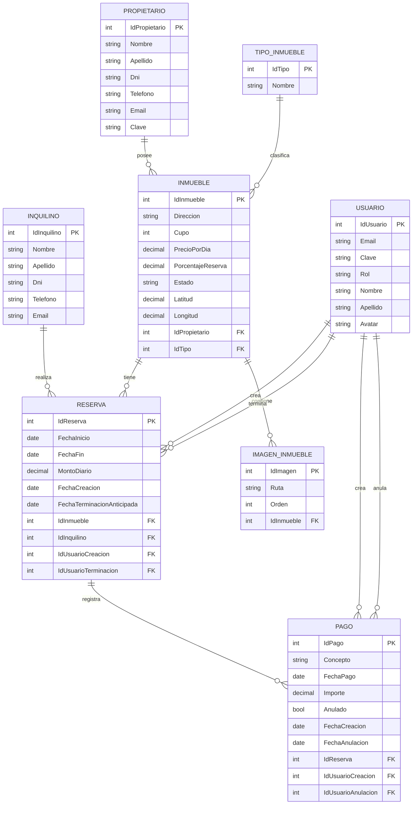

# Sistema de Reservas Temporales

Sistema web para la gestión de una inmobiliaria dedicada al alquiler temporario de propiedades, desarrollado en ASP.NET Core MVC con MySQL. Esta entrega implementa el ABM (Alta, Baja y Modificación) de Propietarios e Inquilinos.

---

## 👥 Integrantes del Grupo

- **Cuello Rafael Nicolas - nicolascuello12@gmail.com - [RafaCod0011](https://github.com/RafaCod0011)**

---

## 📐 Modelo de Datos

### Diagrama Entidad-Relación (DER)

Diagrama de clases provisional, falta hacer la implementacion final.



---

## 🗄️ Levantar la Base de Datos

El proyecto utiliza **MySQL** como sistema gestor de base de datos.

El script de creación de la base de datos se encuentra en la **raíz del proyecto**:

La base de datos actualmente solo cuenta con dos tablas: Propietario e Inquilino.

```text
inmobiliariaulp.sql
```

### Requisitos

- MySQL
- MySQL Workbench, DBeaver o cualquier cliente compatible con MySQL

### Pasos

1. Clonar el repositorio.

2. Abrir el archivo `inmobiliaria.sql` ubicado en la raíz del proyecto.

3. Ejecutar el script completo desde **MySQL Workbench**, **DBeaver** u otro cliente MySQL.

4. El script creará la base de datos, sus tablas y datos iniciales correspondientes.

5. Verificar que la base de datos haya sido creada correctamente con sus datos antes de ejecutar el proyecto.

> **Importante:** La configuración de conexión del proyecto debe utilizar los datos correspondientes a la instalación local de MySQL.
